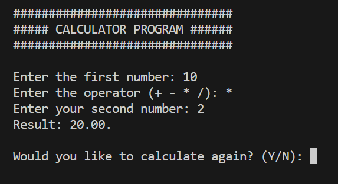
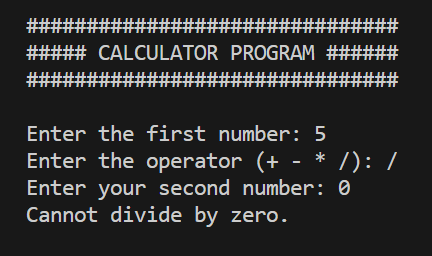

  

# 🧮 Project 5 – Calculator Tool (in C)

This is **Project 5** in a series of mini exercises for **beginners learning C programming**. Each project helps reinforce core programming concepts through small, functional terminal apps.

---

## 📌 About this project

This mini project is a **Calculator Tool**, built to perform basic arithmetic operations between two numbers. It allows users to choose an operator and loop through calculations until they decide to stop.

What it does:

- Accepts two numbers from the user
- Prompts for an arithmetic operator (`+`, `-`, `*`, `/`)
- Prevents division by zero
- Displays the result with two decimal places
- Asks if the user wants to perform another calculation

---

## 🧠 What You’ll Practice

- 🔁 Looping with `while`
- ✅ Using `switch` statements for operation logic
- 🧼 Input validation and buffer cleanup with `" %c"`
- 🔄 User-controlled flow to restart/exit the program

---

## 🖥️ Example Output

📎 Valid calculation example:  

📎 Preventing divide-by-zero:  

---

## 🧠 Challenge Instructions

If you’d like to practice building this project yourself before reviewing the solution, follow these steps:

1. Show a styled welcome message (like the example above).
2. Ask the user for the first number.
3. Prompt for an operator (`+`, `-`, `*`, `/`).  
   - If it's not one of these, display an "Invalid operator" message.
4. Ask for the second number.  
   - If the operator is `/`, check if the second number is **0**.  
   - If it is, print a warning message like `"Cannot divide by zero."` and skip the calculation.
5. Use a `switch` statement to perform the chosen operation.
6. Print the result formatted to **2 decimal places**.
7. Ask if the user wants to calculate again (`Y/N`).
8. Repeat unless the answer is `N` or `n`.

> **Note:** This project is already complete and includes the full solution and the output samples in the `img/` folder.

Happy coding! 🧮✨
